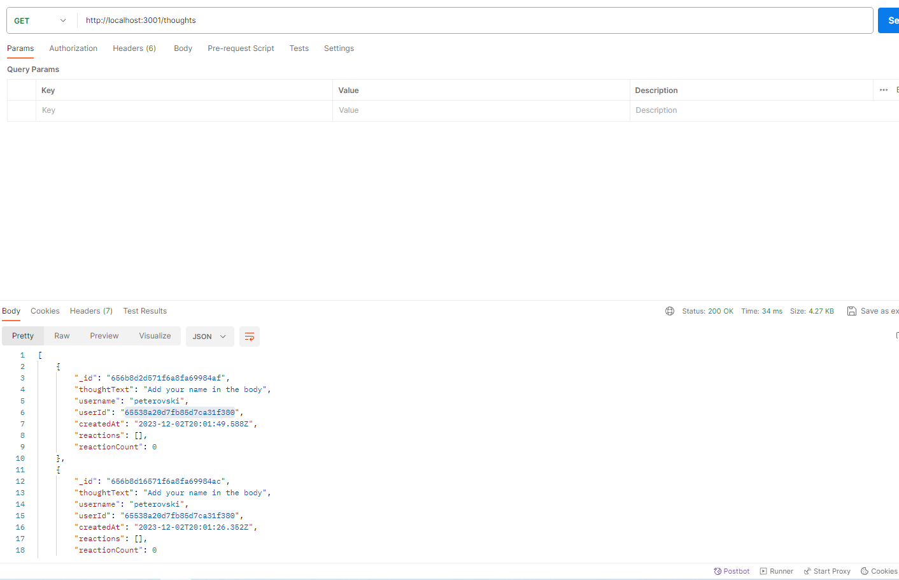

# NoSql-Social-Network API

## Description
The backend of this social media site is powered by MongoDB, serving as a NoSQL database for storing user accounts,
friend connections, thought creation and deletion, and reactions to thought posts.

## Technologies and Languages Used
- Node.js
- Express.js
- MongoDB
- Mongoose

## Installation
Follow the steps below to install this application:
- Download NodeJs and make sure you have access to MongoDB
- Clone the repositary on your computer through your command line interface
- Navigate to the cloned repository from the command line interface
- initialize the NPM registry using `npm init -y`
- Install the required packages using `npm i`
- Call the application using `npm start` to launch the server

## Screenshot

## Usage
This application functions as a RESTful API, providing the ability to perform 
CRUD operations (Create, Read, Update, Delete) for a social media/blog site.

## license
Project is licensed under the MIT License

## Link
- link to walk through video
  https://drive.google.com/file/d/167VhiSccSrvaZNBOc5Wu9AYpXiN0JQ7O/view
